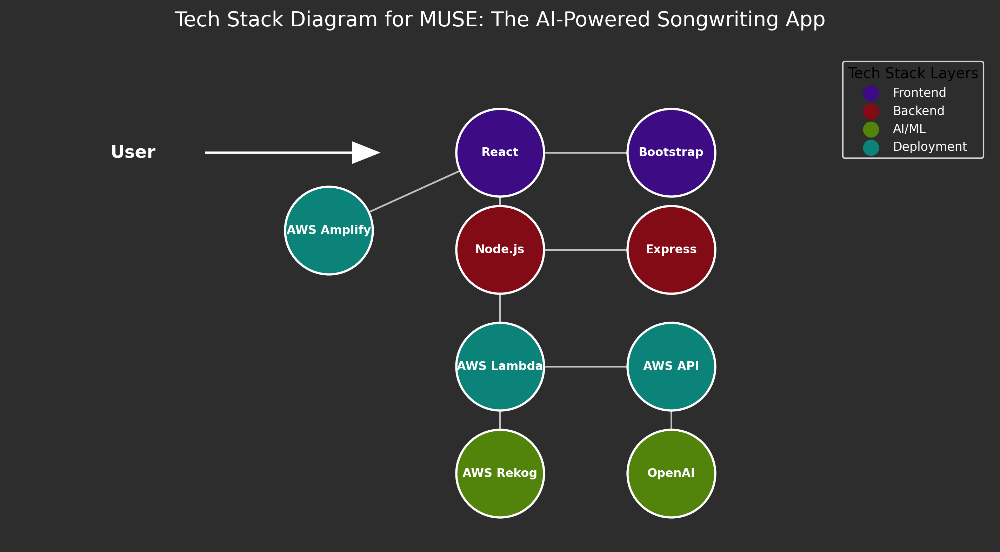

# 🎶 Muse - Generate Song Lyrics from Your Images 🎶

Muse is an AI-powered web application that transforms images into song lyrics. By using Amazon Rekognition to analyze images and OpenAI's language model to generate lyrics, Muse use two different AI services to process an image and turn visual moments into lyrical inspiration. This tool is designed for songwriters, poets, and creatives who want to explore new ways of finding inspiration.

### [Access Current Version Here](https://master.d2el33hfyb2pay.amplifyapp.com/) ###

## Table of Contents

1. [Tech Stack Summary](#tech-stack-summary)
2. [How It Works](#how-it-works)
3. [Installation](#installation)
4. [Usage](#usage)
5. [Customization Options](#customization-options)
6. [API Documentation](#api-documentation)
7. [Contributing](#contributing)
8. [License](#license)

## Tech Stack Summary

Run "src/components/MakeChart.py" to generate a visual.



### Frontend
- **React** (JavaScript framework, Open source)
- **Bootstrap** (CSS framework, Open source)

### Backend
- **Node.js** (JavaScript runtime, Open source)
- **Express** (Web framework, Open source)

### AI and Image Processing
- **OpenAI API** (Lyrics generation, Paid API)
- **AWS Rekognition** (Image analysis, AWS)

### Hosting and Deployment
- **AWS Amplify** (App hosting and deployment, AWS)

### API Management
- **AWS API Gateway** (API management, AWS)
- **AWS Lambda** (Serverless backend functions, AWS)

Each part of this stack is powerful, cost-effective, and scalable—making it the perfect toolkit for building a dynamic, high-quality app without overspending.
## How It Works

1. **Image Upload**: Users upload an image of their choice.
2. **Image Analysis**: The image is sent to Amazon Rekognition, which returns keywords describing the image.
3. **Lyrics Generation**: The keywords are used as a prompt for OpenAI's language model to generate lyrics in the chosen style.
4. **Result Display**: Muse presents the generated song lyrics and keywords on the screen, allowing users to find inspiration instantly.

## Installation

### Prerequisites

- Node.js (v14 or higher)
- AWS account for Rekognition and Lambda setup
- OpenAI API Key

### Steps

1. **Clone the repository**:
   ```bash
   git clone https://github.com/username/muse.git
   ```
2. **Navigate to the project directory**:
   ```bash
   cd muse
   ```
3. **Install dependencies**:
   ```bash
   npm install
   ```
4. **Set up environment variables**:
   - Create a `.env` file and add your API keys:
     ```plaintext
     REACT_APP_OPENAI_API_KEY=your_openai_api_key
     REACT_APP_REKOGNITION_API_KEY=your_aws_rekognition_key
     ```
5. **Run the application**:
   ```bash
   npm start
   ```
   The application should be available at `http://localhost:3000`.

## Usage

1. **Upload an Image**: Click the "Choose File" button and select an image from your device.
2. **Select a Style**: Use the dropdown to choose a lyrical style (e.g., Kenny Chesney for beach vibes).
3. **Generate Lyrics**: Click "Generate Lyrics" to process the image and create a song.
4. **View the Result**: The generated lyrics will be displayed at the top, with keywords from the image shown at the bottom.

## Customization Options

Muse currently offers three distinct lyrical styles:

- **Trop Rock** (100 BPM, Can Choose Keys of C, F, G): Ideal for relaxed, beach-inspired vibes.
- **Southern Blues** (85 BPM, Can Choose Keys of A, E, D): Perfect for deep, soulful sounds that evoke strong emotions.
- **Honkey Tonk Hits** (120 BPM, Can Choose Keys of G, D, E): Great for high-energy, feel-good songs to groove to.

Users can choose a style before generating the lyrics to tailor the output to their creative needs.

## API Documentation

### Endpoint: `/museImageAnalyzer`

- **Method**: POST
- **Description**: Analyzes an uploaded image and generates song lyrics based on selected style.
- **Request Body**:
  ```json
  {
    "image": "base64-encoded-image-data",
    "prompt": "Custom prompt based on selected style"
  }
  ```
- **Response**:
  ```json
  {
    "description": "Generated keywords from Rekognition",
    "lyrics": "Generated song lyrics from OpenAI"
  }
  ```

## Contributing

Muse is an open-source project, and contributions are welcome! If you’d like to contribute, please fork the repository and create a pull request. For major changes, please open an issue to discuss your ideas.

1. **Fork the repository**
2. **Create your feature branch** (`git checkout -b feature/your-feature-name`)
3. **Commit your changes** (`git commit -m 'Add your message'`)
4. **Push to the branch** (`git push origin feature/your-feature-name`)
5. **Open a pull request**

## License

This project is licensed under the MIT License. See the [LICENSE](LICENSE) file for details.
